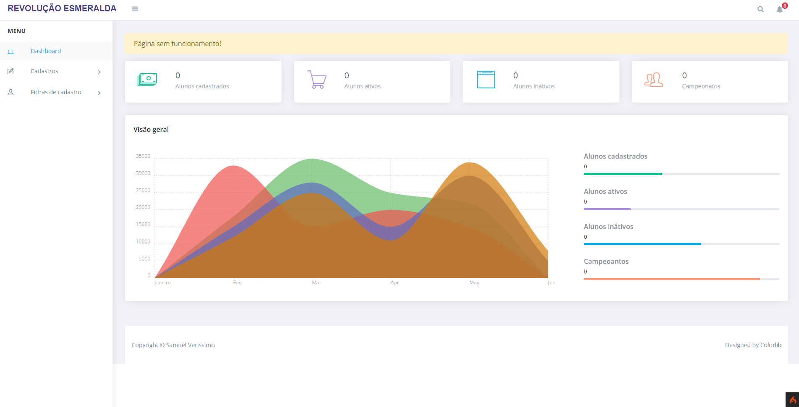

# Projeto revolução esmeralda
Esse sistema foi desenvolvido e implantado de forma voluntária para o projeto social (Revolução esmeralda) localizado em Hortolândia - SP, com a principal finalidade de trazer o gerenciamento completo de ficha dos alunos que fazem parte desse projeto, um sistema bem simples, mas que ajudam o projeto ter um bom controle de seus alunos.

# Tela inicial

### Funcionalidades 

- Cadastro de ficha para alunos       
- Gerenciamento de alunos + documentações

### Tecnologias utilizadas 

- PHP       (CodeIgniter4)
- jQuery    (JavaScript)       
- Bootstrap (Framework) 
- MySQL     (Banco de dados)

